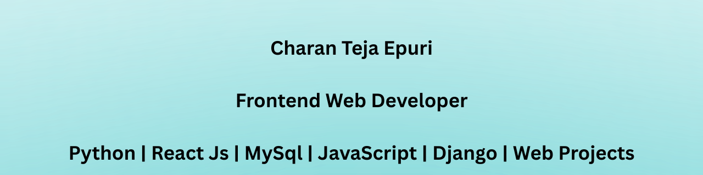

# Hi 👋 I'm Charan

🎓 B.Tech Graduate  
💻 Aspiring Web Developer  
🚀 Passionate about JavaScript & Python Projects  
🔍 Currently seeking opportunities as a Fresher Developer  

I enjoy building practical web projects and sharing my development journey on LinkedIn.

---

## 🚀 Current Focus

- JavaScript Practical Projects
- Bible Reference Web App
- Deep Translator Web App
- Developer Portfolio Website

  🔍 Currently seeking opportunities as a Frontend / Web Developer

## 🏆 GitHub Trophies

---

## 🛠 Tech Stack

DJANGO
FLASK
REACT JS
💻 HTML  
🎨 CSS  
⚡ JavaScript  
TAILWIND CSS
BOOTSTRAP
🐍 Python  
🔧 Git & GitHub  
🗄 SQL
Java(Basics)

## 📊 GitHub Stats

## 🔥 GitHub Streak

## 🌟 Featured Projects

🔹 Bible Reference Web App  
🔹 Deep Translator Web App  
🔹 JavaScript Practical Projects  
🔹 Developer Portfolio Website  

## 📫 Connect With Me

🌐 Portfolio(Django)  
[Django](https://portfolio-site-django.onrender.com/)
[React](https://charan-react-portfolio.vercel.app/)

💼 LinkedIn  
[Link](https://linkedin.com/in/charan-teja-972aa9231))

💻 GitHub  
[Link](https://github.com/charanepuri)
